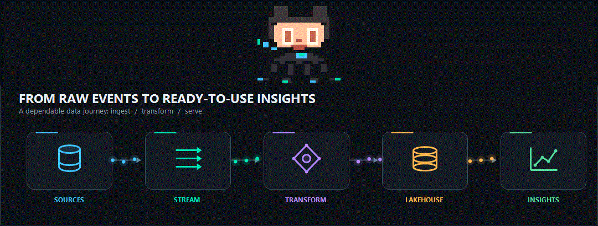

  
  
  

---

## ✨ About Me

I design and build data systems that help businesses move faster, think clearer, and act smarter. With over 8 years of experience in cloud data engineering, I enjoy turning messy, disconnected data into dependable pipelines, scalable platforms, and AI-ready analytics environments.

- 🔭 Currently working on: cloud-native data platforms, end-to-end pipelines, and AI-assisted analytics
- 🌱 Exploring: AutoGen, RAG architectures, semantic retrieval, and GenAI workflows
- 💬 Ask me about: Databricks, Spark, Kafka, Python, SQL, cloud architecture, and scalable ETL
- ⚡ Core philosophy: build systems with clarity, performance, and long-term maintainability
- 📈 Personal interest: financial market analysis, portfolio thinking, and continuous learning

---

## 🧠 What I Do Best

| Capability | Impact |
|-----------|--------|
| Data Architecture | Scalable and cloud-first foundations |
| ETL & Pipelines | Reliable data movement from source to insight |
| Big Data Engineering | Distributed processing with speed and resilience |
| Analytics Enablement | BI-ready, decision-support systems |
| AI/ML Data Readiness | Clean pipelines for intelligent workflows |

## 🛠️ Tech Stack

<table>
  <tr>
    <td width="50%" valign="top" style="padding: 12px;">
      <strong>Cloud &amp; Data Platforms</strong>  
      
      
      
      
    </td>
    <td width="50%" valign="top" style="padding: 12px;">
      <strong>Languages</strong>  
      
      
      
      
    </td>
  </tr>
  <tr>
    <td width="50%" valign="top" style="padding: 12px;">
      <strong>Big Data &amp; Processing</strong>  
      
      
      
      
    </td>
    <td width="50%" valign="top" style="padding: 12px;">
      <strong>Databases</strong>  
      
      
      
      
    </td>
  </tr>
  <tr>
    <td colspan="2" valign="top" style="padding: 12px;">
      <strong>Tools &amp; Platforms</strong>  
      
      
      
      
    </td>
  </tr>
</table>

---

## 📊 GitHub Pulse

<table>
  <tr>
    <td>
      
    </td>
    <td>
      
    </td>
  </tr>
</table>

---

## 🏆 Recognition

---

## 🌐 Connect

> “I build data systems that make complexity feel simple, and insights feel actionable.”

**⭐ If my work adds value, a star is always appreciated. ⭐**

